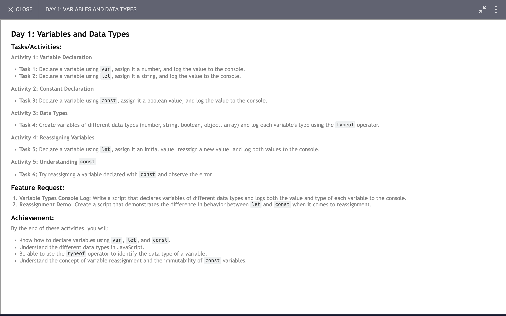

# Day 1: Report

## Task


## What I learned

The keywords let and var both declare new variables in JavaScript. The difference between let and var is in the scope of the variables they create:

<ul>
  <li>
    Variables declared by let are only available inside the block where they’re defined.
  </li>
  <li>
    Variables declared by var are available throughout the function in which they’re declared.
  </li>
</ul>
Consider the difference between these two JavaScript functions:

```javascript
function varScoping() {
  var x = 1;

  if (true) {
    var x = 2;
    console.log(x); // will print 2
  }

  console.log(x); // will print 2
}

function letScoping() {
  let x = 1;

  if (true) {
    let x = 2;
    console.log(x); // will print 2
  }

  console.log(x); // will print 1
}
```

In varScoping(), one x variable is used throughout the function, even though an x variable is declared in two different places with different values.

In letScoping(), two distinct x variables are used – one appears in the main function body and another in the if block. This behavior remains the same if we replace the first let keyword with a var keyword:
```javascript
function varAndLetScoping() {
  var x = 1;

  if (true) {
    let x = 2;
    console.log(x); // will print 2
  }

  console.log(x); // will print 1
}
```

A var variable will be available thoroughout the function body in which it is defined, no matter how deeply nested its definition. A let variable will only be available within the same block where it is defined. See below:
```javascript
function nestedScopeTest() {
  if (true) {
    var functionVariable = 1;
    let blockVariable = 2;

    console.log(functionVariable); // will print 1
    console.log(blockVariable); // will print 2

    if (true) {
      console.log(functionVariable); // will print 1
      console.log(blockVariable); // will print 2
    }
  }

  console.log(functionVariable); // will print 1
  console.log(blockVariable); // will throw an error
}
```
This works because the var declaration of functionVariable is hoisted to the top level of nestedScopeTest() before execution, but the let declaration of blockVariable is not.

The behavior of var can be useful in some cases, but is quite different from other programming languages, and can cause difficult-to-resolve bugs. The more recently introduced let keyword allows for more precise and predictable variable scoping, and allows programmers to safely reuse names for temporary variables within the same function.

One final point to note is that when working outside of function bodies, at a global level, let does not create a property on the global object, whereas var does. Therefore:

```javascript
// Global variables
var x = 1;
let y = 2;
console.log(this.x); // will print 1
console.log(this.y); // will print undefined
```

### Summary
<ul>
  <li>
    Lar is used when we need to create a variable inside of a block and want to access the var on the whole function.
  </li>
  <li>
    Let is used when we need to create a variable that should be only accessed inside the block.
  </li>
  <li>
    Const is used when we need to create a variable that should only be accessed inside the block, and the value of the variable remains unchanged.
  </li>
</ul>

