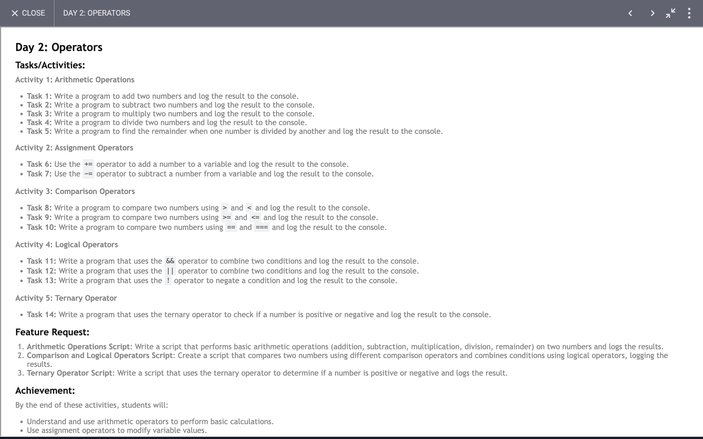

# Day 2: Report

## Task


### What We Learned and Achieved

#### 1. Basic Arithmetic Operations
We created functions to perform basic arithmetic operations: addition, subtraction, multiplication, division, and modulus. Each function takes two parameters, performs the corresponding operation, and prints the result.

```javascript
function addTwoNumber(a, b){
  const ans = a + b;
  console.log(ans);
}

function subTwoNumber(a, b){
  const ans = a - b;
  console.log(ans);
}

function mulTwoNumber(a, b){
  const ans = a * b;
  console.log(ans);
}

function divTwoNumber(a, b){
  const ans = a / b;
  console.log(ans);
}

function modTwoNumber(a, b){
  const ans = a % b;
  console.log(ans);
}
```

#### 2. Usage of Operators
We created a function to demonstrate the usage of various operators including:
- Assignment operators (`+=`, `-=`).
- Comparison operators (`<`, `>`).
- Logical operators (`&&`, `||`, `!`).

```javascript
function operators(){
  let i = 0;
  i += 4; // i becomes 4
  console.log(i);

  i -= 2; // i becomes 2
  console.log(i);

  console.log(i < 3); // true
  console.log(i > 3); // false

  console.log(0 && "0"); // 0
  console.log(0 || "0"); // "0"
  console.log(!false); // true
}
```

#### 3. Conditional (Ternary) Operator
We used the ternary operator to check if a number is positive or negative and print the result.

```javascript
function checkNumber(number){
  let ans = number > 0 ? "Positive" : "Negative";
  console.log(ans);
}
```

#### 4. Function Execution and Output
We executed all the functions with specific arguments to observe the output and understand the behavior of each operation.

```javascript
checkNumber(-3);       // Outputs: Negative
operators();           // Outputs the results of various operator operations
addTwoNumber(2, 3);    // Outputs: 5
subTwoNumber(2, 3);    // Outputs: -1
mulTwoNumber(2, 3);    // Outputs: 6
divTwoNumber(2, 3);    // Outputs: 0.6666666666666666
modTwoNumber(2, 3);    // Outputs: 2
```

### Achievements
1. **Understanding of Basic Arithmetic**: We reinforced the basic arithmetic operations and their implementation in JavaScript.
2. **Operators in Action**: We saw how different operators work and interact with values, helping us understand their practical usage.
3. **Conditional Logic**: By using the ternary operator, we practiced simple conditional logic.
4. **Function Usage**: We enhanced our understanding of defining and calling functions, passing arguments, and handling return values.
5. **Practical Coding**: By writing, executing, and debugging these functions, we improved our coding skills and problem-solving abilities.

Overall, this exercise provided a comprehensive overview of fundamental programming concepts and their implementation in JavaScript.