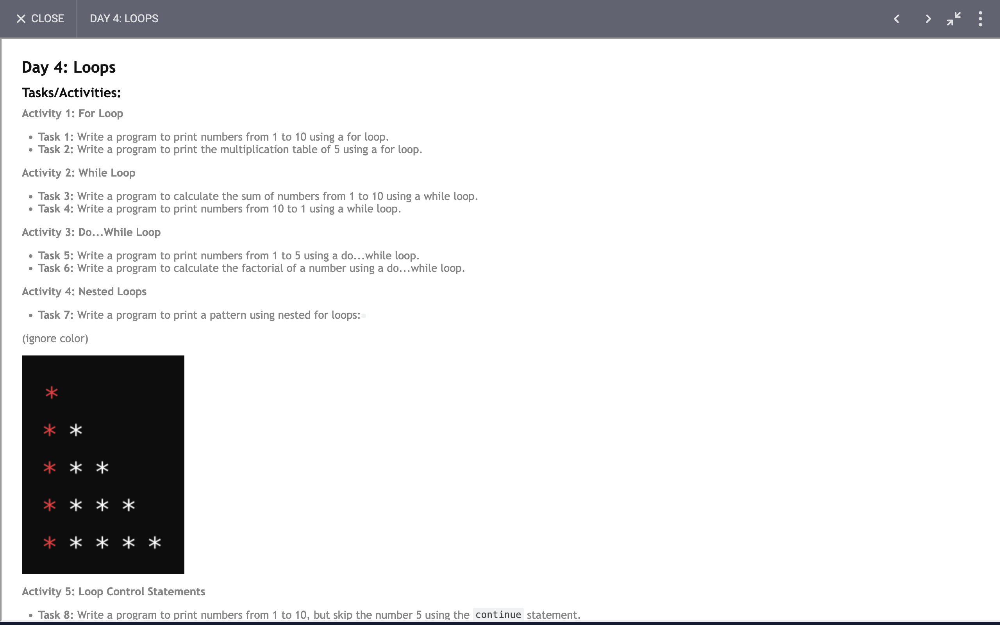
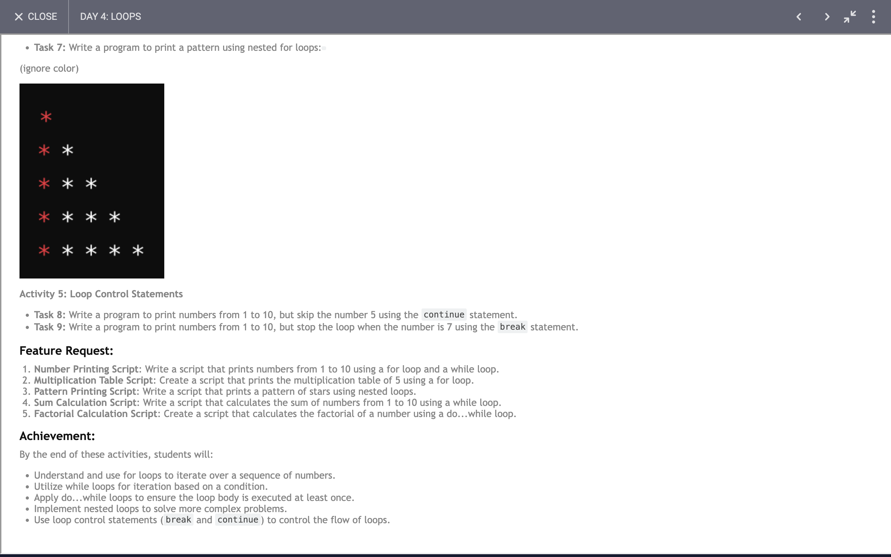

# Day 4: Report

## Task



### Report on Achievements and Learnings from the Given Functions

#### Overview
We explored various functions that demonstrate loops and control statements. Each function showcases a different aspect of looping, control flow, and basic arithmetic operations. This exercise helped us solidify our understanding of loops, conditionals, and patterns in programming.

### Detailed Learnings and Achievements

#### 1. Function: `print10Number`
```javascript
function print10Number(){
  for(let i=0; i<10; i++){
    console.log(i);
  }
}
```
**Learning:**
- **For Loop:** Use of the `for` loop to iterate from 0 to 9.
- **Iteration:** Basic iteration through a defined range.

**Achievement:**
- **Printing Numbers:** Successfully printed numbers from 0 to 9 using a `for` loop.

#### 2. Function: `table`
```javascript
function table(num){
  for(let i=0; i<=10; i++){
    console.log(`${num} * ${i} = ${num * i}`);
  }
}
```
**Learning:**
- **Multiplication Table:** Generating a multiplication table for a given number.
- **Template Literals:** Use of template literals for string interpolation.

**Achievement:**
- **Table Generation:** Generated and printed a multiplication table for the specified number.

#### 3. Function: `sum`
```javascript
function sum(num){
  let sum = 0;
  while(num > 0){
    sum += num;
    num--;
  }
  console.log(sum);
}
```
**Learning:**
- **While Loop:** Use of `while` loop to perform repetitive addition.
- **Decrement Operator:** Decrementing the loop variable within the loop.

**Achievement:**
- **Sum Calculation:** Calculated the sum of numbers from the given number down to 1 using a `while` loop.

#### 4. Function: `printNum`
```javascript
function printNum(num){
  while(num >= 0){
    console.log(num);
    num--;
  }
}
```
**Learning:**
- **Countdown Loop:** Printing numbers in descending order.
- **Loop Control:** Understanding loop control with decrementing conditions.

**Achievement:**
- **Descending Order Printing:** Printed numbers from the given number down to 0.

#### 5. Function: `printPattern`
```javascript
function printPattern(){
  for(let i=0; i<5; i++){
    let str = "";
    for(let j=0; j<=i; j++){
      str += "*";
    }
    console.log(str);
  }
}
```
**Learning:**
- **Nested Loops:** Using nested loops to generate a pattern.
- **String Concatenation:** Building strings within a loop.

**Achievement:**
- **Pattern Generation:** Generated and printed a right-angled triangle pattern of asterisks.

#### 6. Function: `loopWithCont`
```javascript
function loopWithCont(){
  for(let i=0; i<10; i++){
    if(i == 5){
      continue;
    }
    console.log(i);
  }
}
```
**Learning:**
- **Continue Statement:** Skipping an iteration when a condition is met.
- **Conditional Logic:** Controlling loop flow with conditions.

**Achievement:**
- **Conditional Loop Execution:** Demonstrated the effect of `continue` by skipping the number 5.

#### 7. Function: `loopWithBreak`
```javascript
function loopWithBreak(){
  for(let i=0; i<10; i++){
    if(i == 7){
      break;
    }
    console.log(i);
  }
}
```
**Learning:**
- **Break Statement:** Exiting the loop when a condition is met.
- **Loop Termination:** Understanding loop termination with `break`.

**Achievement:**
- **Early Loop Termination:** Demonstrated the effect of `break` by stopping the loop at number 7.

### Summary
Through these exercises, we improved our understanding of:
- Loop constructs (`for`, `while`)
- Control flow statements (`continue`, `break`)
- String manipulation and template literals
- Nested loops and pattern generation
- Basic arithmetic operations within loops

These functions helped reinforce core programming skills, making us more proficient in writing and understanding loops and control flow in JavaScript. We successfully applied these concepts to solve practical problems and generate useful outputs.