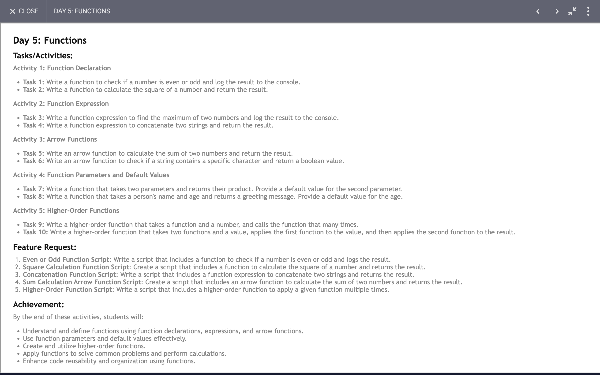

# Day 4: Report

## Task

## Report on JavaScript Functions

### Objective
The primary objective was to explore and understand the implementation and usage of various JavaScript functions. These functions cover a range of operations such as mathematical calculations, string manipulations, and higher-order functions.

### Functions Overview

1. **oddEven(num)**
   - **Description**: Determines if a number is odd or even.
   - **Logic**: Uses the modulus operator to check if the number is divisible by 2.
   - **Example**: `oddEven(5)` returns `"Odd"`.

2. **square(num)**
   - **Description**: Calculates the square of a given number.
   - **Logic**: Multiplies the number by itself.
   - **Example**: `square(5)` returns `25`.

3. **findMax(num1, num2)**
   - **Description**: Finds the maximum of two numbers.
   - **Logic**: Compares the two numbers and returns the larger one.
   - **Example**: `findMax(5, 6)` returns `6`.

4. **concatString(str1, str2)**
   - **Description**: Concatenates two strings.
   - **Logic**: Uses the `+` operator to join two strings.
   - **Example**: `concatString("Hello", "World")` returns `"HelloWorld"`.

5. **sum(num1, num2)**
   - **Description**: Calculates the sum of two numbers.
   - **Logic**: Uses an arrow function to add two numbers.
   - **Example**: `sum(5, 6)` returns `11`.

6. **contain(str, ch)**
   - **Description**: Checks if a string contains a specific character.
   - **Logic**: Uses the `includes` method to check for character presence.
   - **Example**: `contain("Hello", "H")` returns `true`.

7. **product(num1, num2 = 4)**
   - **Description**: Calculates the product of two numbers, with a default value for the second parameter.
   - **Logic**: Multiplies the two numbers, using `4` as the default for the second number.
   - **Example**: `product(5)` returns `20`.

8. **greeting(name, age = 18)**
   - **Description**: Generates a greeting message.
   - **Logic**: Uses template literals to create a greeting string, with a default age value.
   - **Example**: `greeting("John")` returns `"Hello John, you are 18 years old"`.

9. **higherOrderFunction(num, operation)**
   - **Description**: Demonstrates a higher-order function that applies a given operation on numbers from 0 to `num-1`.
   - **Logic**: Loops through numbers and applies the passed function to each.
   - **Example**: `higherOrderFunction(5, operation)` prints squares of numbers from 0 to 4.

10. **operation(num)**
    - **Description**: Calculates the square of a number (helper function).
    - **Logic**: Multiplies the number by itself.
    - **Example**: `operation(5)` returns `25`.

11. **twoFunction(num, fun1, fun2)**
    - **Description**: Applies two functions sequentially on a number.
    - **Logic**: Applies the first function to the number and then the second function to the result of the first.
    - **Example**: `twoFunction(5, square, oddEven)` returns `"Odd"`.

### Achievements

1. **Understanding of Basic Functions**: Learned how to implement simple functions for basic arithmetic operations and string manipulations.
2. **Arrow Functions**: Gained familiarity with arrow function syntax and default parameters.
3. **Higher-Order Functions**: Explored higher-order functions and their utility in applying operations to sequences of values.
4. **Function Composition**: Demonstrated function composition by passing the result of one function as input to another.
5. **Template Literals**: Used template literals for creating dynamic strings with embedded expressions.

### Conclusion

This exercise provided a comprehensive understanding of various JavaScript functions and their applications. We learned how to implement basic arithmetic and string operations, use arrow functions, handle default parameters, and create higher-order functions. These concepts are fundamental in JavaScript programming and are widely applicable in more complex programming scenarios.
