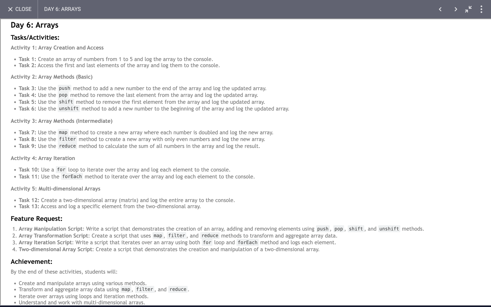

# Day 6: Report

## Task

### Functions and Their Operations:

1. **`arrayFrom0ToNumber(num)`**:
    - **Purpose**: Creates an array with values from 1 to `num`.
    - **Key Operations**:
        - Initializes an empty array.
        - Uses a `for` loop to fill the array with numbers from 1 to `num`.
        - Calls `printArr(arr)` to print the array.

2. **`fristAndLast(arr)`**:
    - **Purpose**: Prints the first and last elements of an array.
    - **Key Operations**:
        - Logs the first element of the array (`arr[0]`).
        - Logs the last element of the array (`arr[arr.length - 1]`).

3. **`printArr(arr)`**:
    - **Purpose**: Prints all values of an array in one line.
    - **Implementation**: Should use `console.log(arr.join(' '))` to print array values separated by spaces.

4. **`funInArray()`**:
    - **Purpose**: Demonstrates various array manipulation methods.
    - **Key Operations**:
        - `push`: Adds an element to the end of the array.
        - `pop`: Removes the last element of the array.
        - `shift`: Removes the first element of the array.
        - `unshift`: Adds an element to the beginning of the array.
        - Calls `printArr(arr)` after each operation to print the array.

5. **`arrayMethods()`**:
    - **Purpose**: Demonstrates common array methods such as `map`, `filter`, and `reduce`.
    - **Key Operations**:
        - `map`: Applies a function to each element of the array.
        - `filter`: Creates a new array with elements that pass a test.
        - `reduce`: Reduces the array to a single value by applying a function.

6. **`loops(num)`**:
    - **Purpose**: Demonstrates different looping methods over an array.
    - **Key Operations**:
        - `for` loop: Iterates over the array using index.
        - `forEach`: Executes a function for each array element.

7. **`twoDArray()`**:
    - **Purpose**: Demonstrates accessing elements in a two-dimensional array.
    - **Key Operations**:
        - Logs the entire 2D array.
        - Logs a specific element from the 2D array (`num[1][2]`).

### What We Learn and Achieve:

1. **Array Initialization and Manipulation**:
    - Creating arrays and populating them with values using loops.
    - Using array methods like `push`, `pop`, `shift`, and `unshift` for adding and removing elements.

2. **Array Traversal and Access**:
    - Accessing elements using indices.
    - Looping through arrays with `for` loops and `forEach`.

3. **Higher-order Array Methods**:
    - `map`: Transforms elements.
    - `filter`: Selects elements based on conditions.
    - `reduce`: Aggregates array elements into a single value.

4. **Two-dimensional Arrays**:
    - Initializing and accessing elements in a 2D array.
    - Understanding nested array structures.

5. **Printing and Logging**:
    - Printing arrays and specific elements to the console.
    - Using `join` to print array elements in a formatted way.

### Learn more about code 
[Index.js](./index.js)