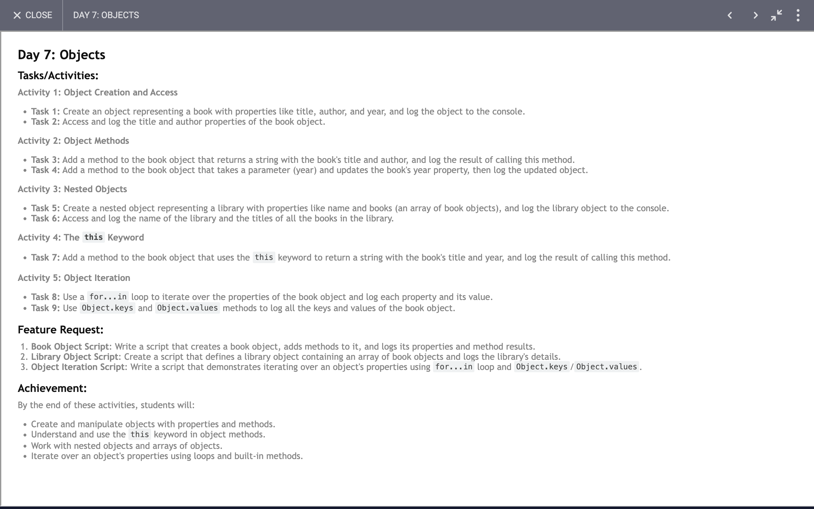

# Day 7: Report

## Task



### Concepts and Operations Demonstrated in the Code:

1. **Object Creation and Manipulation**:
    - **Creation**: The code demonstrates how to create objects in JavaScript with properties like `title`, `author`, and `year`.
    - **Accessing Properties**: Shows how to access and print object properties using dot notation (e.g., `book1.title`).
    - **Updating Properties**: Illustrates updating object properties through a function (`changeTheYear`).

2. **Template Literals**:
    - **Usage**: Template literals are used to embed expressions within strings using backticks and `${}` syntax.

3. **Object Methods**:
    - **Creating Methods**: Shows how to define methods within an object and call them (e.g., `getTitleAndAuthor`).

4. **Nested Objects**:
    - **Library Example**: Demonstrates creating an object (`library`) that contains other objects as its properties, showing how to handle nested objects.
    - **Accessing Nested Properties**: Accessing properties of objects within objects (e.g., `library.books[0].author`).

5. **Iterating Over Object Properties**:
    - **`for...in` Loop**: Iterates over all properties of an object and prints their keys and values.
    - **`Object.keys` Method**: Retrieves and prints all keys of an object.
    - **`Object.values` Method**: Retrieves and prints all values of an object.

6. **The `this` Keyword**:
    - **Usage in Methods**: Demonstrates the use of the `this` keyword within an object's method to refer to the object itself (e.g., `useOfThis.printAll`).

### Code Breakdown and Learning Points:

1. **Object Initialization and Property Access**:
    ```javascript
    const book1 = {
      title: "my book",
      author: "my name",
      year: "2024"
    };
    const book2 = {
      title: "my book 2",
      author: "my name 2",
      year: "2023"
    };

    console.log(book1);
    console.log(`Title of my book ${book1.title}`);
    console.log(`Author of my book ${book1.author}`);
    ```

    - **Learning Point**: Basic object initialization and property access using dot notation and template literals for string interpolation.

2. **Defining and Using Methods**:
    ```javascript
    function getTitleAndAuthor() {
      return `Title of my book ${book1.title} and author of my book ${book1.author}`;
    }
    console.log(getTitleAndAuthor());
    ```

    - **Learning Point**: Creating a function that accesses object properties and returns a formatted string.

3. **Updating Object Properties**:
    ```javascript
    function changeTheYear(year) {
      book1.year = year;
    }
    changeTheYear(2025);
    console.log(book1);
    ```

    - **Learning Point**: Modifying object properties through a function.

4. **Nested Objects and Property Access**:
    ```javascript
    const library = {
      name: "lib",
      books: [book1, book2],
    };

    console.log(library);
    console.log(library.books[0].author);
    ```

    - **Learning Point**: Working with nested objects and accessing properties within nested structures.

5. **Iterating Over Object Properties**:
    ```javascript
    function forToIn() {
      for (let key in book1) {
        console.log(key + ": " + book1[key]);
      }
    }

    function keys() {
      console.log("keys");
      const keys = Object.keys(book1);
      console.log(keys);
    }

    function values() {
      console.log("values");
      const values = Object.values(book1);
      console.log(values);
    }

    values();
    keys();
    ```

    - **Learning Point**: Using `for...in` to iterate over object properties and `Object.keys` and `Object.values` to retrieve keys and values of an object.

6. **Using `this` in Object Methods**:
    ```javascript
    const useOfThis = {
      name: "my name",
      work: "none",
      printAll: function () {
        console.log(this.name);
      }
    };
    useOfThis.printAll();
    ```

    - **Learning Point**: Demonstrates the use of `this` keyword within an object method to access the object's properties.

### Final Thoughts:

The provided code effectively demonstrates various fundamental concepts related to objects in JavaScript, including creation, manipulation, accessing properties, iterating over properties, and the usage of the `this` keyword. By working through these examples, one gains a solid understanding of how to work with objects and their properties and methods in JavaScript.