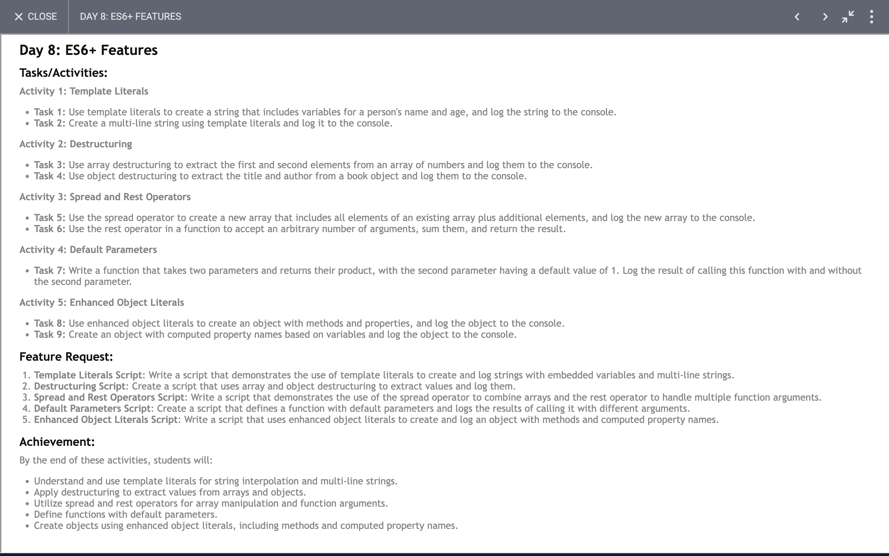

# Day 8: Report

## Task



### Summary of JavaScript Concepts and Achievements

1. **String Literals**:
    - **Template Literals**: We learned how to use template literals for embedding expressions within strings.
    - **Example**: Constructing a string that includes variables using `${variableName}` syntax.
    
    ```javascript
    const name = "name";
    const age = 19;
    const message = `Hello, my name is ${name} and I am ${age} years old.`;
    console.log(message);
    ```

2. **Multi-line Strings**:
    - **Template Literals for Multi-line Strings**: We learned how to create multi-line strings easily with template literals.
    
    ```javascript
    const multiLineMessage = `
    This is a 
    multi-line 
    string using 
    template literals.
    `;
    console.log(multiLineMessage);
    ```

3. **Destructuring**:
    - **Array Destructuring**: We learned how to extract values from arrays using destructuring.
    
    ```javascript
    const numbers = [10, 20, 30, 40, 50];
    const [first, second] = numbers;
    console.log(`First element: ${first}`);
    console.log(`Second element: ${second}`);
    ```

4. **Object Destructuring**:
    - **Object Destructuring**: We learned how to extract properties from objects using destructuring.
    
    ```javascript
    const book = {
        title: "To Kill a Mockingbird",
        author: "Harper Lee",
        year: 1960
    };
    const { title, author } = book;
    console.log(`Title: ${title}`);
    console.log(`Author: ${author}`);
    ```

5. **Spread Operator**:
    - **Array Spread Operator**: We learned how to create a new array by spreading elements of an existing array.
    
    ```javascript
    const existingArray = [1, 2, 3, 4, 5];
    const newArrayWithIndividualElements = [...existingArray, 6, 7, 8];
    console.log(newArrayWithIndividualElements);
    ```

6. **Rest Parameters**:
    - **Function Rest Parameters**: We learned how to use rest parameters to handle an indefinite number of arguments in a function.
    
    ```javascript
    function sumAll(...numbers) {
        return numbers.reduce((accumulator, currentValue) => accumulator + currentValue, 0);
    }
    const result = sumAll(1, 2, 3, 4, 5);
    console.log(result); // Output: 15
    ```

7. **Default Parameters**:
    - **Function Default Parameters**: We learned how to set default values for function parameters.
    
    ```javascript
    function product(x, y = 4) {
        return x * y;
    }
    console.log(product(2, 3)); // Output: 6
    console.log(product(2));    // Output: 8
    ```

8. **Enhanced Object Literals**:
    - **Shorthand Property Names and Methods**: We learned how to use shorthand property names and define methods inside an object.
    
    ```javascript
    const name = "Alice";
    const age = 30;
    const person = {
        name,
        age,
        greet() {
            console.log(`Hello, my name is ${this.name} and I am ${this.age} years old.`);
        }
    };
    console.log(person);
    person.greet();
    ```

9. **Computed Property Names**:
    - **Dynamic Property Names**: We learned how to use computed property names in objects.
    
    ```javascript
    const propName = "dynamicProperty";
    const value = "This is a dynamic value";
    const dynamicObject = {
        [propName]: value,
        staticProperty: "This is a static value"
    };
    console.log(dynamicObject);
    ```

### Achievements:
- **Understanding Modern JavaScript Features**: We've covered various modern JavaScript features that simplify code and enhance readability.
- **Effective Code Writing**: Learning these features helps in writing more concise and maintainable code.
- **Versatile Functions**: Use of rest parameters, default parameters, and destructuring makes functions more versatile and easier to use.
- **Enhanced Object Management**: Using enhanced object literals and computed property names streamlines the creation and manipulation of objects.
- **Improved Readability and Maintainability**: Multi-line strings and template literals improve the readability of the code.
