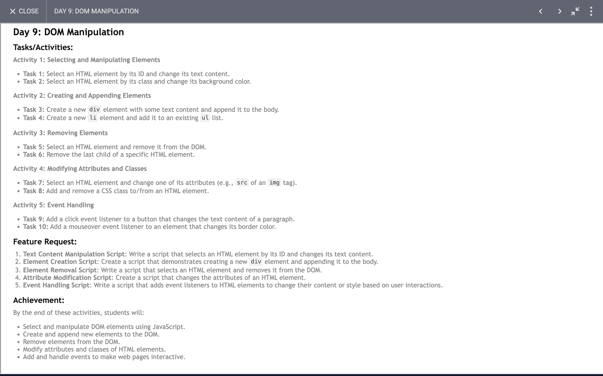

# Day 9: Report

## Task


### DOM Manipulation and Styling

1. **Selecting Elements:**
   - `document.querySelector('.content')`: Selects the first element with the class `content`.
   - `document.querySelector('.classwithcolor')`: Selects the first element with the class `classwithcolor`.
   - `document.querySelector('img')`: Selects the first `img` element.
   - `document.querySelector('button')`: Selects the first `button` element.

2. **Changing Content:**
   - `content.innerHTML = "Hello World!"`: Sets the inner HTML of the selected `content` element to "Hello World!".
   - `div.innerHTML = "I'm a new div!"`: Sets the inner HTML of the newly created `div` element.
   - `li.innerHTML = "I'm a new li!"`: Sets the inner HTML of the newly created `li` element.
   - `li.innerHTML = "I'm now changed by button!"`: Changes the inner HTML of the `li` element when the button is clicked.

3. **Creating and Appending Elements:**
   - `document.createElement('div')`: Creates a new `div` element.
   - `content.appendChild(div)`: Appends the newly created `div` element to the `content` element.
   - `document.createElement('li')`: Creates a new `li` element.
   - `content.appendChild(li)`: Appends the newly created `li` element to the `content` element.

4. **Styling Elements:**
   - Setting multiple styles on the `colordiv` element:
     ```javascript
     colordiv.style.width = '500px';
     colordiv.style.height = '500px';
     colordiv.style.backgroundColor = 'red';
     colordiv.style.color = 'white';
     colordiv.style.textAlign = 'center';
     ```
   - Setting styles on the `img` element:
     ```javascript
     img.style.width = '500px';
     img.style.height = '500px';
     ```

5. **Setting Attributes:**
   - `img.src = './day-09.png'`: Sets the `src` attribute of the `img` element.

### Event Handling

1. **Click Event:**
   - `button.addEventListener('click', () => { ... })`: Adds a click event listener to the button element. When the button is clicked, it changes the `li` content, sets a border style to `colordiv`, and shows an alert.

2. **Mouseover and Mouseout Events:**
   - `colordiv.addEventListener('mouseover', () => { ... })`: Adds a mouseover event listener to the `colordiv` element, changing its background color to blue when the mouse hovers over it.
   - `colordiv.addEventListener('mouseout', () => { ... })`: Adds a mouseout event listener to the `colordiv` element, changing its background color back to red when the mouse leaves it.

### Summary

- **Element Selection:** Understanding how to select elements using `querySelector`.
- **Content Manipulation:** Changing the inner HTML of elements to update content dynamically.
- **Element Creation and Insertion:** Creating new elements (`div`, `li`) and appending them to existing elements in the DOM.
- **Styling Elements:** Applying CSS styles directly to elements via JavaScript.
- **Attribute Manipulation:** Setting attributes (like `src` for images) dynamically.
- **Event Handling:** Adding event listeners for user interactions (`click`, `mouseover`, `mouseout`) to perform specific actions in response to these events.
