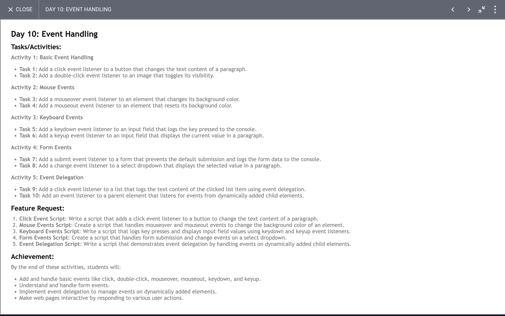

# Day 10: Report

## Task


### I have learned and achieved the following:

### 1. **Event Handling**
We have utilized different types of event listeners to handle various user interactions with HTML elements.

#### Button Click Event
```javascript
const button = document.querySelector('button');
button.addEventListener('click', () => {
  let data = para.innerHTML;
  data += " clicked ";
  console.log(data)
  para.innerHTML = data;
});
```
- **Objective**: Append "clicked" to the content of a paragraph element and log it to the console whenever the button is clicked.
- **Key Concept**: Using the `click` event to update the content of an element.

#### Image Double-Click Event
```javascript
myimg.addEventListener('dblclick',  () => {
  myimg.style.visibility = myimg.style.visibility === 'hidden' ? 'visible' : 'hidden';
});
```
- **Objective**: Toggle the visibility of an image when it is double-clicked.
- **Key Concept**: Using the `dblclick` event to toggle the CSS property of an element.

#### Mouseover and Mouseout Events
```javascript
div.addEventListener('mouseover', () => {
  div.style.backgroundColor = 'blue';
});

div.addEventListener('mouseout', () => {
  div.style.backgroundColor = 'red';
});
```
- **Objective**: Change the background color of a `div` when the mouse hovers over and leaves it.
- **Key Concept**: Using `mouseover` and `mouseout` events to change the styling of an element.

#### Keyboard Events
```javascript
input.addEventListener('keydown', (value) => {
  console.log(value.key)
});

input.addEventListener('keyup', (value) => {
  para.innerHTML += value.key;
});
```
- **Objective**: Log the key pressed to the console and append the key to the paragraph content.
- **Key Concept**: Using `keydown` and `keyup` events to capture and respond to keyboard input.

### 2. **Form and Select Element Handling**
#### Select Change Event
```javascript
document.getElementById('mySelect').addEventListener('change', (event) => {
  let selectedValue = event.target.value;
  document.getElementById('selectedValue').innerText = 'Selected value: ' + selectedValue;
});
```
- **Objective**: Display the selected value of a dropdown menu in a paragraph.
- **Key Concept**: Using the `change` event to detect and respond to changes in a select element.

### 3. **Event Delegation**
Event delegation allows us to handle events for dynamically added elements.

#### List Item Click Event
```javascript
document.getElementById('myList').addEventListener('click', function(event) {
  if (event.target && event.target.nodeName === 'LI') {
    console.log('Clicked item text:', event.target.textContent);
  }
});
```
- **Objective**: Log the text content of a clicked list item.
- **Key Concept**: Using event delegation to handle clicks on list items.

#### Dynamically Added Children Event Handling
```javascript
document.getElementById('addChildButton').addEventListener('click', () => {
  let newChild = document.createElement('button');
  newChild.textContent = 'I am a new child';
  newChild.className = 'child';
  document.getElementById('parentElement').appendChild(newChild);
});

document.getElementById('parentElement').addEventListener('click', (event) => {
  if (event.target && event.target.classList.contains('child')) {
    console.log('Clicked child text:', event.target.textContent);
  }
});
```
- **Objective**: Add new child elements dynamically and handle their click events using the parent element.
- **Key Concept**: Using event delegation to manage events for dynamically added elements.

### Summary
Through this code, we learned how to:
- Use various event listeners (`click`, `dblclick`, `mouseover`, `mouseout`, `keydown`, `keyup`, `change`).
- Dynamically update HTML content and styles in response to user interactions.
- Use event delegation to manage events for both static and dynamically added elements, providing efficient event handling.