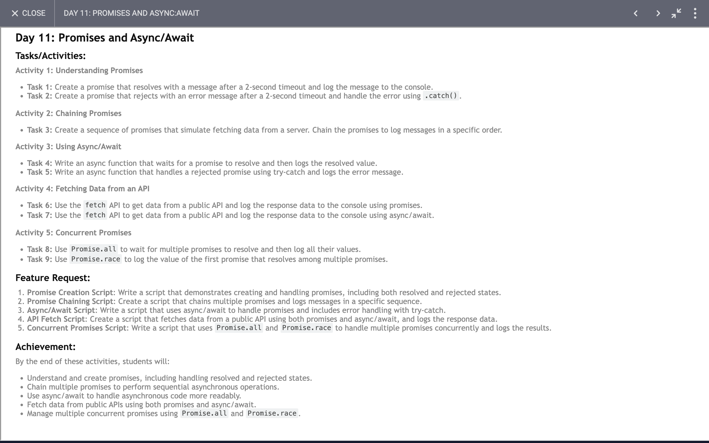

# Day 11: Report

## Task


### I have learned and achieved the following:

### 1. Basic Promise Handling

#### Creating and Handling Resolved and Rejected Promises
```javascript
const solvedPromise = new Promise((resolve, _) => {
  setTimeout(() => {
    resolve("time out end");
  }, 2000)
});

const errorPromise = new Promise((_, reject) => {
  setTimeout(() => {
    reject(new Error('Something went wrong!'));
  }, 2000);
});

solvedPromise
  .then((result) => {
    console.log('Promise resolved:', result);
  })
  .catch((error) => {
    console.error('Promise rejected:', error.message);
  });

errorPromise
  .then((result) => {
    console.log('Promise resolved:', result);
  })
  .catch((error) => {
    console.error('Promise rejected:', error.message);
  });
```
- **Objective**: Understand how to create promises that resolve or reject after a delay.
- **Key Concept**: Handling resolved and rejected promises using `.then` and `.catch`.

### 2. Chaining Promises

#### Sequential Promise Handling
```javascript
const fetchData = (data, delay) => {
  return new Promise((resolve) => {
    setTimeout(() => {
      resolve(data);
    }, delay);
  });
};

fetchData('Fetching user data...', 1000)
  .then((message) => {
    console.log(message);
    return fetchData('Fetching posts...', 2000);
  })
  .then((message) => {
    console.log(message);
    return fetchData('Fetching comments...', 1500);
  })
  .then((message) => {
    console.log(message);
    console.log('All data fetched successfully!');
  })
  .catch((error) => {
    console.error('Error fetching data:', error);
  });
```
- **Objective**: Fetch and log data in a specific order.
- **Key Concept**: Chaining promises to ensure sequential execution of asynchronous tasks.

### 3. Using `async/await`

#### Handling Promises with `async/await`
```javascript
async function resolvePromise() {
  const res = await fetchData('Fetching user data...', 1000);
  console.log(res);
  console.log("All data fetched.");
}

async function resolvePromiseWithError() {
  try {
    console.log("Solving error promise");
    const res = await errorPromise;
    console.log(res);
  } catch (error) {
    console.log(error.message);
  }
}

resolvePromise();
resolvePromiseWithError();
```
- **Objective**: Fetch data using `async/await` and handle errors using `try/catch`.
- **Key Concept**: Simplify asynchronous code with `async/await` and manage errors gracefully.

### 4. Fetching Data from an API

#### Using Fetch API with Promises
```javascript
const fetchingData = () => {
  fetch("https://official-joke-api.appspot.com/random_joke")
    .then((res) => res.json())
    .then((data) => {
      console.log(data);
    })
    .catch((err) => {
      console.log(err.message);
    });
};

const fetchingDataWithAwait = async () => {
  try {
    const res = await fetch("https://official-joke-api.appspot.com/random_joke");
    const data = await res.json();
    console.log(data);
  } catch (err) {
    console.log(err.message);
  }
};

fetchingData();
fetchingDataWithAwait();
```
- **Objective**: Fetch data from an external API using both promises and `async/await`.
- **Key Concept**: Understand different ways to handle API calls and process JSON responses.

### 5. Using `Promise.all`

#### Handling Multiple Promises Concurrently
```javascript
const promise1 = fetchData('User data', 2000);
const promise2 = fetchData('Posts data', 5000);
const promise3 = fetchData('Comments data', 1500);

Promise.all([promise1, promise2, promise3])
  .then((values) => {
    console.log('All data fetched:', values);
  })
  .catch((error) => {
    console.error('Error fetching data:', error);
  });
```
- **Objective**: Wait for multiple promises to resolve and handle their results together.
- **Key Concept**: Using `Promise.all` to perform concurrent operations and handle results as a group.

### 6. Using `Promise.race`

#### Handling the First Resolved Promise
```javascript
Promise.race([promise1, promise2, promise3])
  .then((value) => {
    console.log('First data fetched:', value);
  })
  .catch((error) => {
    console.error('Error fetching data:', error);
  });
```
- **Objective**: Log the result of the first resolved promise.
- **Key Concept**: Using `Promise.race` to get the fastest result among multiple promises.

### Summary
Through the code examples, you have learned:
- How to create and handle promises, both resolved and rejected.
- How to chain promises to ensure sequential execution.
- How to use `async/await` for more readable asynchronous code.
- How to fetch data from an API using both promises and `async/await`.
- How to use `Promise.all` to wait for multiple promises to resolve.
- How to use `Promise.race` to get the first resolved promise.

These skills are fundamental for managing asynchronous operations in JavaScript, making your code more robust and easier to understand.