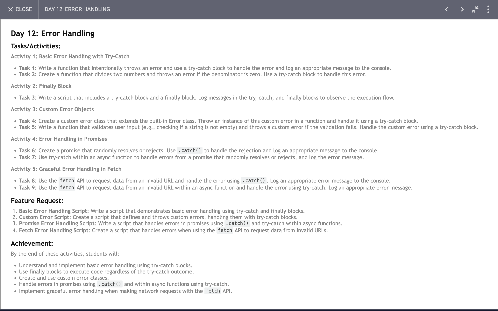

# Day 12: Report

## Task

## Code 
[Click Here](./index.js)

### I have learned and achieved the following:

### Basic Error Handling

1. **Function: `errorfunction`**
   - Throws a basic error with a message.

2. **Function: `trycatching`**
   - Demonstrates a try-catch block where `errorfunction` is called. If an error is thrown, it is caught, and an error message is logged.

3. **Function: `divide`**
   - Shows how to handle division by zero using a try-catch block. If the denominator is zero, an error is thrown and caught, displaying an appropriate message.

### Flow Control with Try-Catch-Finally

4. **Function: `flowOfData`**
   - Illustrates the use of try-catch-finally blocks. The `finally` block executes regardless of whether an error is thrown, and it updates the `value` variable.

### Custom Error Handling

5. **Class: `ErrorNote`**
   - Creates a custom error class that extends the built-in `Error` class, adding custom properties (`name` and `type`).

6. **Function: `tryCustomError`**
   - Demonstrates throwing and catching a custom error. The custom error's properties are logged when caught.

### User Validation

7. **Function: `userChecking`**
   - Uses a try-catch block to handle user validation. If the user is invalid, an error is thrown and caught, logging an appropriate message.

8. **Function: `checkUser`**
   - Validates a user object, ensuring all required fields are present. Throws an error if any field is missing.

### Promises

9. **Constant: `randomPromise`**
   - Creates a promise that resolves or rejects based on a random value. The promise is handled using `.then` and `.catch` to log success or error messages.

10. **Function: `createRandomPromise`**
    - Returns the `randomPromise`.

11. **Async Function: `handlePromise`**
    - Uses async/await with try-catch to handle the promise. Logs messages based on whether the promise resolves or rejects.

### Fetch API

12. **Function: `fetching`**
    - Demonstrates basic fetch usage with `.then` and `.catch` to handle responses and errors from an API call.

13. **Async Function: `fetchingWithAsync`**
    - Uses async/await for the same API call, handling responses and errors within a try-catch block.

### Summary of Achievements and Learnings

- **Error Handling**: We learned how to handle synchronous errors using try-catch blocks, ensuring that our application can manage unexpected conditions gracefully.
- **Flow Control**: The try-catch-finally structure ensures certain code runs regardless of errors, useful for cleanup tasks.
- **Custom Errors**: Creating custom error classes helps provide more detailed and context-specific error information.
- **Validation**: Using try-catch for validation helps maintain code clarity and manage invalid input efficiently.
- **Promises**: We learned how to handle asynchronous operations using promises, with `.then` and `.catch` methods for success and error handling.
- **Async/Await**: Using async/await syntax with try-catch for asynchronous code improves readability and error management.
- **Fetch API**: Demonstrates making network requests, handling responses, and managing errors using both promise chaining and async/await syntax.

These practices are fundamental for robust and maintainable JavaScript programming, ensuring that applications can handle both expected and unexpected scenarios gracefully.