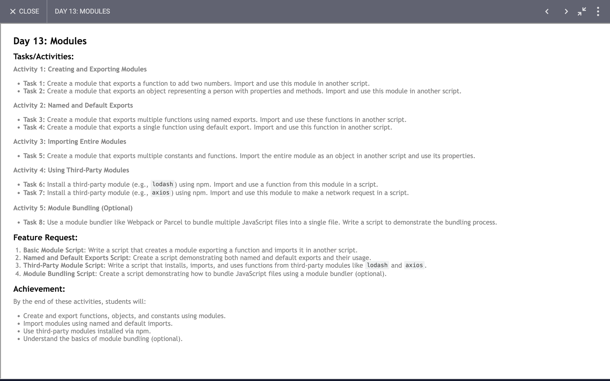

# Day 13: Report

## Task

## Code 
[Click Here](./src/index.js)

### JavaScript and ES Modules

1. **Import and Export:**
   - We learned about ES6 module syntax with `import` and `export`. The code demonstrates importing functions and objects from `modules.js` and `utils.js`, and exporting functions and objects for use in other modules.

2. **Using Third-Party Libraries:**
   - **Axios:** We used `axios` to make HTTP requests. The `useAxios` function retrieves a random joke from an API and logs it to the console.
   - **Lodash:** The use of `lodash` showcases various utility functions:
     - `chunk` to split an array into smaller arrays.
     - `shuffle` to randomize the order of array elements.
     - `compact` to remove falsey values from an array.
     - `cloneDeep` to create a deep clone of an object.
     - `pick` to select specific properties from an object.
     - `merge` to combine objects.
     - `debounce` and `throttle` for managing function calls.

3. **Utility Functions and Constants:**
   - We defined and exported several utility functions (`sum`) and constants (`PI`, `E`) in `modules.js`.

4. **Object Manipulation:**
   - The `person` object includes methods for interacting with object properties. This demonstrates creating and using objects, updating object properties, and invoking methods.

5. **Webpack Configuration:**
   - **Webpack:** The `webpack.config.js` file shows how to configure Webpack for bundling JavaScript files. Key aspects include:
     - Defining an entry point (`index.js`) and output file (`bundle.js`).
     - Setting up Babel for transpiling modern JavaScript using `babel-loader` and `@babel/preset-env`.

### Code Achievements

1. **Console Output:**
   - **Sum Calculation:** Logs the result of summing two numbers.
   - **Person Object Properties:** Logs the name, age, and email of a person, and shows the updated email after modification.
   - **Mathematical Constants and Operations:** Logs mathematical constants and results of arithmetic operations.

2. **Data Fetching:**
   - Demonstrates making an asynchronous HTTP GET request and handling the response with `axios`.

3. **Array Manipulation:**
   - Shows various ways to manipulate arrays using `lodash` such as chunking, shuffling, and compacting.

4. **Function Management:**
   - **Debounce and Throttle:** Demonstrates how to use these techniques to control the frequency of function execution, useful for performance optimization.

5. **Project Setup:**
   - **Package Management:** The `package.json` file defines project dependencies and scripts for building and running the project.
   - **Babel and Webpack Integration:** Configures Babel for transpiling and Webpack for bundling the JavaScript code.

Overall, the code demonstrates effective use of modern JavaScript features, third-party libraries, and tooling to manage a JavaScript project efficiently.