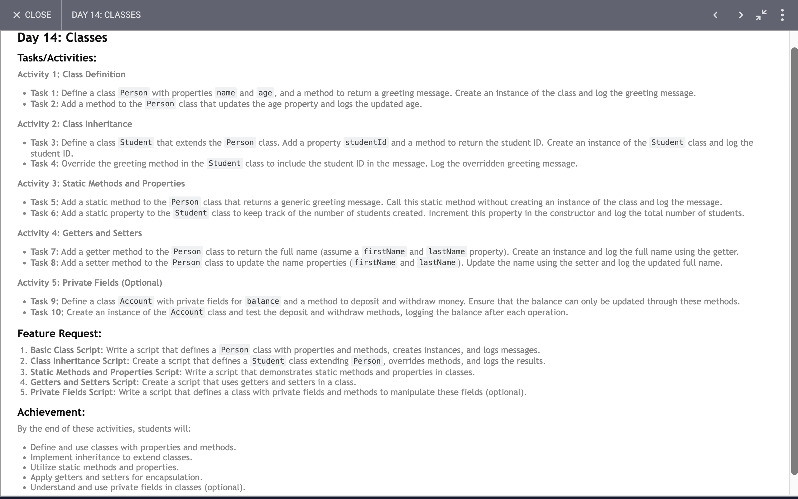

# Day 14: Report

## Task

## Code 
[Click Here](./index.js)

### What We Learned and Achieved: A Comprehensive Overview

In this article, we’ll explore the key concepts and learnings derived from the provided code examples involving classes, inheritance, encapsulation, and static methods in JavaScript.

#### 1. **Class Definitions and Constructors**

**Creating and Managing Classes**

- **Basic Class Definition**: We defined a `Person` class with properties such as `name`, `age`, and `work`. This class includes methods like `greet()` to display a greeting message and `updateAge()` to update and display the person's age.

- **Using Constructors**: The constructor function initializes class properties. We passed an object to the `Person` constructor to set the `name`, `age`, and `work` properties.

**Key Takeaway**: Classes in JavaScript allow for the creation of objects with shared properties and methods, enhancing code reusability and organization.

#### 2. **Encapsulation with Private Fields**

**Private Fields**

- **Encapsulation with Private Fields**: We used private fields (e.g., `#studentId` and `#balance`) to restrict direct access to these fields outside of their class. This promotes better data integrity and encapsulation.

- **Methods to Access and Modify Private Data**: Methods such as `getStudentID()` and `deposit()` provide controlled access to the private fields, ensuring that they can only be updated or retrieved through these methods.

**Key Takeaway**: Private fields in JavaScript classes protect internal data from being accessed or modified directly, which helps maintain encapsulation and data security.

#### 3. **Inheritance and Method Overriding**

**Extending Classes**

- **Inheritance**: We created a `Student` class that extends the `Person` class. The `Student` class inherits properties and methods from `Person` but also has its own private field `#studentId` and a static property `totalStudents`.

- **Overriding Methods**: The `Student` class overrides the `greet()` method from `Person` to include the student ID in the greeting message.

**Key Takeaway**: Inheritance allows for the extension of base classes to create specialized subclasses. Method overriding enables subclasses to provide specific implementations of methods inherited from parent classes.

#### 4. **Static Methods and Properties**

**Using Static Members**

- **Static Methods**: The `genericGreeting()` method in the `Person` class is a static method, meaning it can be called directly on the class itself, not on instances of the class.

- **Static Properties**: The `totalStudents` static property in the `Student` class keeps track of the number of `Student` instances created.

**Key Takeaway**: Static methods and properties provide class-level functionality and data that do not belong to specific instances. They are accessed directly from the class.

#### 5. **Getters and Setters**

**Managing Property Access**

- **Getters**: The `fullName` getter in the `Person` class returns the concatenated first and last names.

- **Setters**: The `fullName` setter allows updating both the first and last names from a single string input.

**Key Takeaway**: Getters and setters provide a way to define custom behavior when accessing or updating properties, enhancing encapsulation and data integrity.

#### 6. **Account Management**

**Implementing an Account Class**

- **Balance Management**: The `Account` class manages a private balance field and provides methods to deposit and withdraw money. Methods like `deposit()` and `withdraw()` update the balance while ensuring encapsulation.

**Key Takeaway**: Using encapsulation to manage financial transactions ensures that balance updates are controlled and secure.

### Conclusion

Through these examples, we've learned how to leverage JavaScript classes for effective object-oriented programming. Key concepts include:

- **Class Definition**: Creating and managing class properties and methods.
- **Encapsulation**: Using private fields to protect data.
- **Inheritance**: Extending base classes and overriding methods.
- **Static Members**: Utilizing static methods and properties for class-level functionality.
- **Getters and Setters**: Customizing access and updates to properties.
- **Encapsulation in Financial Operations**: Managing and updating sensitive data like account balances securely.

These concepts are foundational for writing clean, maintainable, and secure JavaScript code.