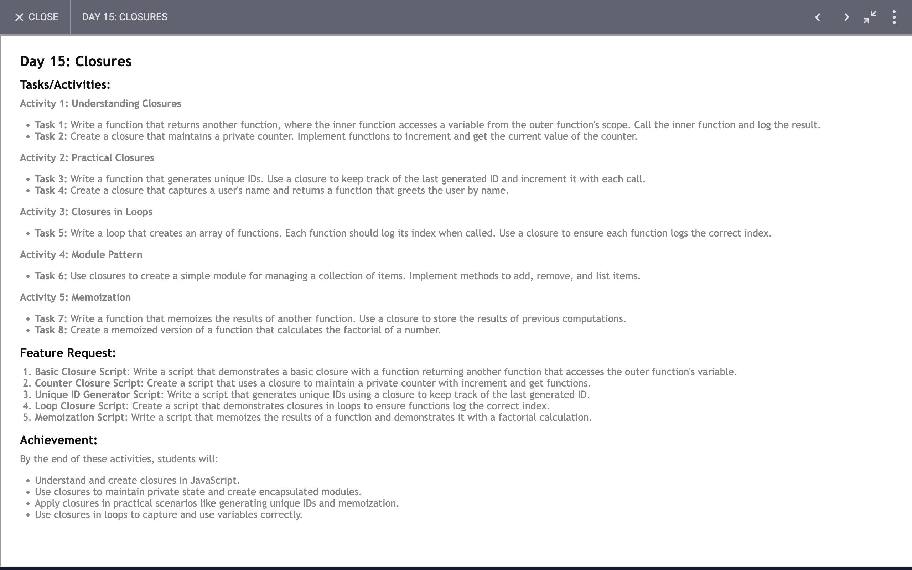

# Day 15: Report

## Task


## Code 
[Click Here](./index.js)


### Understanding Closures and Functional Programming in JavaScript

JavaScript is a powerful language that supports functional programming concepts, and closures are one of its most fundamental features. Closures allow functions to retain access to variables from their lexical scope even after the outer function has finished executing. In this article, we'll explore various examples of closures and functional programming techniques, demonstrating their practical applications and benefits.

#### 1. **Understanding Closures**

A closure is a function that has access to its own scope, the scope of the outer function, and the global scope. This enables functions to remember the environment in which they were created. Let's look at some practical examples:

- **Outter Function and Inner Function**

```javascript
function outterFunction(){
  let outterVariable = "I am outter variable";
  function innerFunction(){
      outterVariable = 'I am changed outter variable';
      console.log(outterVariable);
  }
  return innerFunction;
}

const inner = outterFunction();
inner(); // Output: I am changed outter variable
```

In this example, `innerFunction` maintains access to `outterVariable` even after `outterFunction` has executed. This is a simple illustration of how closures preserve access to their outer function's variables.

#### 2. **Creating a Counter with Closures**

Closures are useful for creating private state. Here’s how you can create a counter that maintains its state between calls:

```javascript
function createCounter() {
  let counter = 0;
  
  return {
    increment: function() {
      counter++;
    },
    getCounter: function() {
      return counter;
    }
  };
}

const counter1 = createCounter();
counter1.increment();
counter1.increment();
console.log(counter1.getCounter()); // Output: 2
```

In this example, `createCounter` returns an object with methods that manipulate a private `counter` variable. The `counter` variable is encapsulated within the closure, protecting it from external modification.

#### 3. **Generating Unique IDs**

Closures can also be used to generate unique IDs, ensuring that each ID is unique and sequential:

```javascript
function createIDGenerator() {
  let lastID = 0;
  
  return function() {
      lastID += 1;
      return lastID;
  };
}

const generateID = createIDGenerator();
console.log(generateID()); // Output: 1
console.log(generateID()); // Output: 2
```

Here, `createIDGenerator` maintains the state of `lastID` and provides a function to generate the next unique ID.

#### 4. **Greeting Users**

Closures are useful for personalizing content:

```javascript
function createGreeter(userName) {
  return function() {
      return `Hello, ${userName}!`;
  };
}

const greetAlice = createGreeter("Alice");
const greetBob = createGreeter("Bob");

console.log(greetAlice()); // Output: Hello, Alice!
console.log(greetBob());   // Output: Hello, Bob!
```

The `createGreeter` function captures the `userName` and returns a personalized greeting function.

#### 5. **Creating Logging Functions**

Using closures to create functions that log their index:

```javascript
function createLoggingFunctions(num) {
  let functionsArray = [];

  for (let i = 0; i < num; i++) {
    functionsArray.push((function(index) {
      return function() {
        console.log(index);
      };
    })(i));
  }

  return functionsArray;
}

const loggingFunctions = createLoggingFunctions(5);
loggingFunctions.forEach(fn => fn());
```

Each function in the array logs its own index, thanks to the closure capturing the current index value.

#### 6. **Managing Collections with Closures**

Encapsulating a collection and its management functions:

```javascript
function createItemManager() {
  let items = [];

  function addItem(item) {
    items.push(item);
  }

  function removeItem(item) {
    items = items.filter(i => i !== item);
  }

  function listItems() {
    return items.slice();
  }

  return {
    addItem,
    removeItem,
    listItems
  };
}

const manager = createItemManager();
manager.addItem('Apple');
manager.addItem('Banana');
console.log(manager.listItems()); // Output: ['Apple', 'Banana']
manager.removeItem('Banana');
console.log(manager.listItems()); // Output: ['Apple']
```

The `createItemManager` function provides methods to manage a private list of items, demonstrating how closures can be used to create well-encapsulated modules.

#### 7. **Memoization for Performance Optimization**

Memoization is a technique to cache results of expensive function calls:

```javascript
function memoize(fn) {
  const cache = {};
  return function(...args) {
    const key = JSON.stringify(args);
    if (cache.hasOwnProperty(key)) {
      return cache[key];
    }
    const result = fn(...args);
    cache[key] = result;
    return result;
  };
}

function slowFunction(num) {
  console.log('Computing...');
  return num * num;
}

const memoizedSlowFunction = memoize(slowFunction);
console.log(memoizedSlowFunction(5)); // Output: Computing... 25
console.log(memoizedSlowFunction(5)); // Output: 25 (cached result)
```

The `memoize` function creates a cache to store results of function calls, reducing redundant computations and improving performance.

#### 8. **Factorial Calculation with Memoization**

Memoizing a recursive factorial function:

```javascript
function fac(num) {
  if (num === 1) {
    return 1;
  }
  return num * fac(num - 1);
}

function caluculatefac(fac) {
  let cache = {};
  return function(...args) {
    const key = JSON.stringify(args);
    if (cache.hasOwnProperty(key)) {
      return cache[key];
    }
    const result = fac(...args);
    cache[key] = result;
    return result;
  }
}

const memoizedFac = caluculatefac(fac);
console.log(memoizedFac(4)); // Output: 24
console.log(memoizedFac(4)); // Output: 24 (cached result)
```

The `caluculatefac` function memoizes the results of the factorial calculation, demonstrating how memoization can be applied to recursive functions.

### Conclusion

These examples illustrate how closures in JavaScript enable powerful and flexible programming techniques. Whether you’re managing state, creating personalized functions, or optimizing performance, closures provide a robust mechanism for encapsulating and managing data. By understanding and applying these concepts, you can write more efficient, modular, and maintainable JavaScript code.