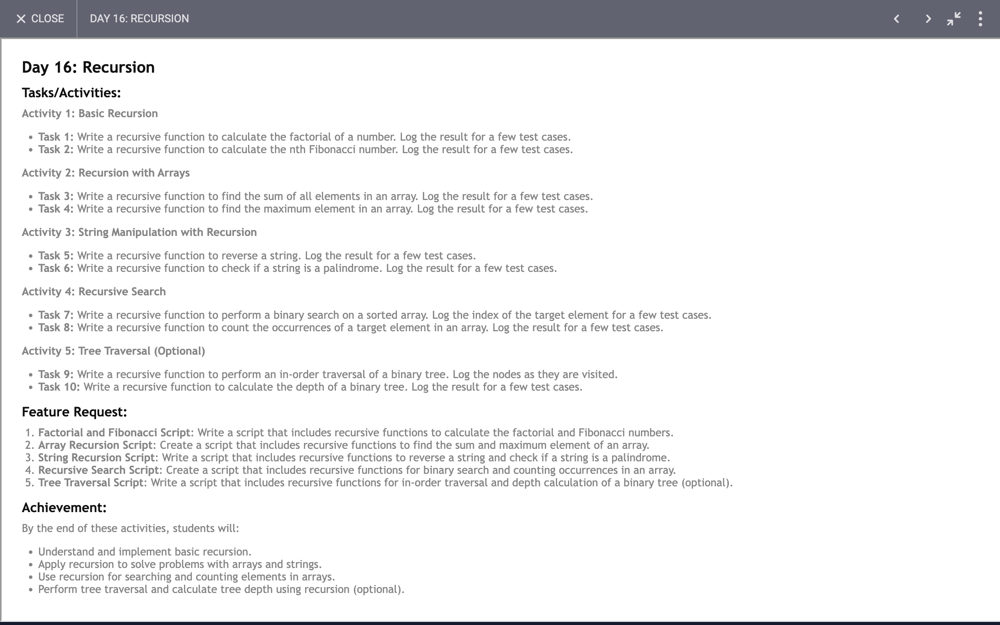

# Day 16: Report

## Task


## Code 
[Click Here](./index.js)

### Exploring Recursion and Binary Trees: A Deep Dive

In this article, we'll explore various recursive algorithms and their practical applications through JavaScript functions. We'll delve into recursive solutions for calculating factorials, Fibonacci numbers, array operations, string manipulations, binary search, and tree traversals. Additionally, we'll learn about the depth of binary trees and the properties of palindromes.

#### 1. Factorial Calculation

The factorial of a number \( n \) (denoted as \( n! \)) is the product of all positive integers less than or equal to \( n \). We implemented a recursive function to compute factorials:

```javascript
function fac(num) {
  if (num === 1) {
    return 1;
  }
  return num * fac(num - 1);
}
```

**What We Learned:**
- **Base Case**: The recursion halts when \( num \) is 1.
- **Recursive Case**: The function calls itself with \( num - 1 \), multiplying the result by \( num \).

#### 2. Fibonacci Sequence

The Fibonacci sequence is defined by the relation \( F(n) = F(n-1) + F(n-2) \) with initial values \( F(0) = 0 \) and \( F(1) = 1 \). Here’s a recursive implementation:

```javascript
function fib(n) {
  if (n === 1) return 1;
  if (n === 0) return 0;
  return fib(n - 1) + fib(n - 2);
}
```

**What We Learned:**
- **Base Cases**: Handle \( n \) values of 0 and 1 directly.
- **Recursive Case**: Summing the results of two previous function calls to generate the Fibonacci number.

#### 3. Array Operations

**Sum of Array Elements:**

```javascript
function sumArray(arr) {
  if (arr.length === 0) {
    return 0;
  } else {
    return arr[0] + sumArray(arr.slice(1));
  }
}
```

**Max Element in Array:**

```javascript
function maxElement(arr) {
  if (arr.length === 1) {
    return arr[0];
  } else {
    return Math.max(arr[0], maxElement(arr.slice(1)));
  }
}
```

**What We Learned:**
- **Sum**: Uses the first element and recursively adds the sum of the rest of the array.
- **Max Element**: Compares the first element with the maximum of the rest of the array.

#### 4. String Manipulations

**Reverse a String:**

```javascript
function reverseString(str) {
  if (str.length === 0) {
    return "";
  }
  return reverseString(str.slice(1)) + str[0];
}
```

**Palindrome Check:**

```javascript
function checkPalindrom(str) {
  if (str.length === 0) {
    return true;
  }
  if (str[0] !== str[str.length - 1]) {
    return false;
  }
  return checkPalindrom(str.slice(1));
}
```

**What We Learned:**
- **Reverse String**: Recursively appends the last character of the string to the reversed remainder.
- **Palindrome**: Checks the first and last characters and recursively checks the substring.

#### 5. Binary Search

Binary search is used to find an element in a sorted array efficiently:

```javascript
function binarySearch(arr, start, end, target) {
  if (start > end) return -1;

  let mid = Math.floor((start + end) / 2);
  if (arr[mid] === target) return mid;

  if (arr[mid] < target) {
    return binarySearch(arr, mid + 1, end, target);
  } else {
    return binarySearch(arr, start, mid - 1, target);
  }
}
```

**What We Learned:**
- **Recursive Division**: The array is split into halves to find the target, reducing the search space efficiently.

#### 6. Tree Traversals and Depth Calculation

**In-Order Traversal of a Binary Tree:**

```javascript
function inOrderTraversal(node) {
  if (node === null) return;

  inOrderTraversal(node.left);
  console.log(node.value);
  inOrderTraversal(node.right);
}
```

**Depth Calculation of a Binary Tree:**

```javascript
function calculateDepth(node) {
  if (node === null) return 0;

  const leftDepth = calculateDepth(node.left);
  const rightDepth = calculateDepth(node.right);

  return Math.max(leftDepth, rightDepth) + 1;
}
```

**What We Learned:**
- **In-Order Traversal**: Visits left subtree, current node, and right subtree recursively.
- **Depth Calculation**: Determines the height of the tree by recursively calculating the depths of subtrees.

### Conclusion

Recursion is a powerful tool in programming, offering elegant solutions to problems involving repetitive processes and hierarchical structures. By mastering recursive functions, you gain the ability to handle complex tasks with simpler, more readable code. From calculating factorials and Fibonacci numbers to performing binary searches and tree traversals, recursion demonstrates its versatility and efficiency in various scenarios.