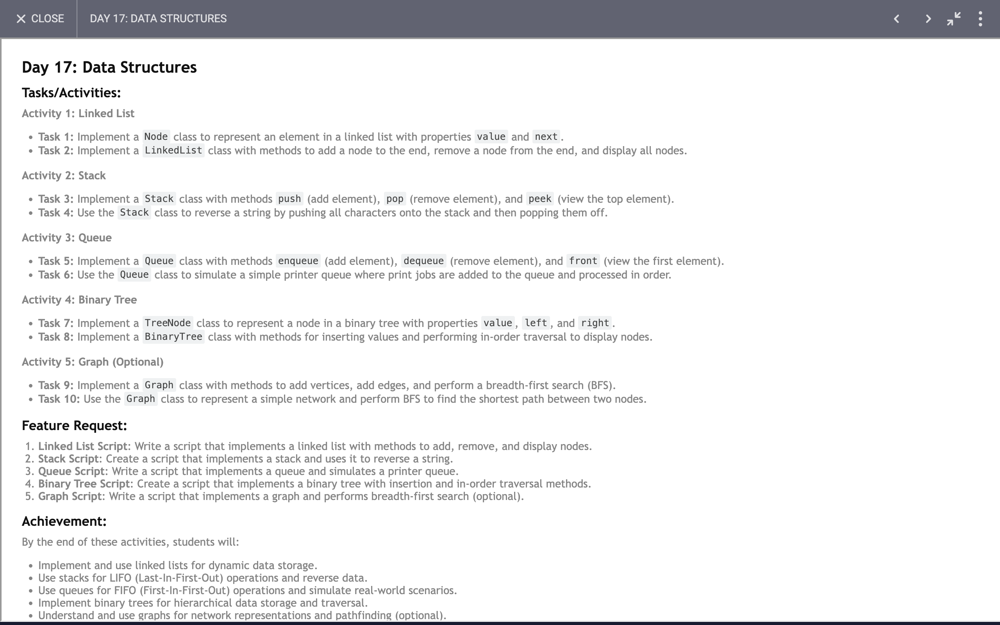

# Day 17

## Task

## Code 
[Click Here](./index.js)

## Understanding Data Structures and Algorithms in JavaScript

### 1. Linked Lists
- **Node Class**: Basics of node creation and linkage.
- **LinkedList Class**: Insertion at beginning and end, and accessing nodes by index.
- **Stack Implementation**: Using a linked list to manage stack operations (push, pop, peek).
- **String Reversal with Stack**: Applying stack principles to reverse a string.

### 2. Queues
- **Queue Class**: Basic operations (enqueue, dequeue, front, size, isEmpty).
- **PrinterQueue**: Managing print jobs using a queue.

### 3. Binary Trees
- **TreeNode Class**: Structure for binary tree nodes.
- **BinaryTree Class**: Insertion of nodes and in-order traversal.

### 4. Graphs
- **Graph Class**: Representation using adjacency lists.
- **Vertex and Edge Operations**: Adding and removing vertices and edges.
- **Depth-First Search**: Traversing nodes and exploring paths.
- **Shortest Path**: Finding shortest paths between nodes using BFS.