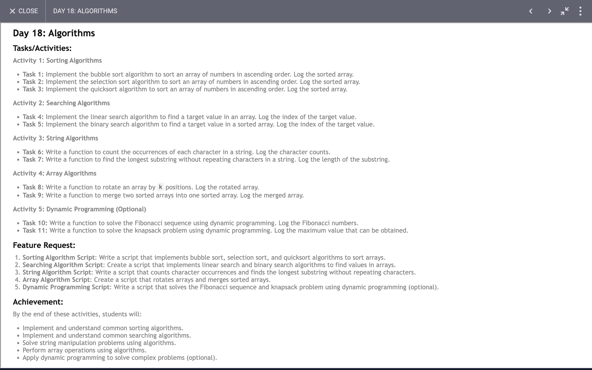

# Day 18

## Task

## Code 
[Click Here](./index.js)

### Exploring Fundamental Algorithms and Data Structures in JavaScript

In our exploration of fundamental algorithms and data structures using JavaScript, we've tackled a range of problems that are central to understanding how efficient software systems are built. Here’s a summary of what we’ve learned from implementing various algorithms and solving specific problems:

#### **1. Sorting Algorithms**

Sorting is a fundamental concept in computer science that allows data to be ordered in a specific sequence. We implemented three classic sorting algorithms:

- **Bubble Sort**: This simple algorithm repeatedly steps through the list, compares adjacent elements, and swaps them if they are in the wrong order. Although easy to understand, bubble sort is not efficient for large datasets due to its O(n^2) time complexity.

- **Selection Sort**: This algorithm divides the list into a sorted and unsorted region. It repeatedly selects the smallest (or largest) element from the unsorted region and moves it to the end of the sorted region. Like bubble sort, selection sort also has O(n^2) time complexity, but it generally performs fewer swaps.

- **Quick Sort**: A much faster, divide-and-conquer sorting algorithm that sorts elements by partitioning an array into smaller sub-arrays. The efficiency of quick sort (average case O(n log n)) makes it suitable for large datasets, although its worst-case complexity is still O(n^2) if not implemented with precautions.

#### **2. Searching Algorithms**

Searching algorithms are crucial for retrieving data efficiently:

- **Linear Search**: A straightforward approach where each element is checked one by one until the target is found. It has O(n) time complexity and is best for unsorted or small datasets.

- **Binary Search**: A more efficient algorithm that works on sorted arrays by repeatedly dividing the search interval in half. With O(log n) time complexity, binary search is highly effective for large datasets but requires sorted data.

#### **3. String Manipulation**

String operations are commonly needed in programming:

- **Length of Longest Substring Without Repeating Characters**: This function uses a sliding window technique with a hash set to keep track of characters and find the longest substring without repeating characters efficiently.

- **Count Character Occurrences**: A function that counts how many times each character appears in a string using a hash map, which is useful for frequency analysis.

- **Rotate Array**: This function rotates an array by `k` positions using the reversal algorithm. This approach ensures that the rotation is achieved in linear time and is space efficient.

#### **4. Merging Arrays**

Merging two sorted arrays into a single sorted array is an important operation in many algorithms, especially those involving divide-and-conquer strategies. We used a two-pointer technique to merge arrays efficiently.

#### **5. Dynamic Programming**

Dynamic programming is a method for solving complex problems by breaking them down into simpler subproblems:

- **Fibonacci Sequence**: We used dynamic programming to compute Fibonacci numbers, which is much more efficient than the naive recursive approach. This method stores previously computed values to avoid redundant calculations.

- **Knapsack Problem**: A classic optimization problem where we used a 2D array to store the maximum value achievable with a given weight capacity. This dynamic programming solution efficiently finds the best combination of items to maximize value.

### Conclusion

Implementing these algorithms and data structures has provided a comprehensive understanding of core concepts in computer science. From sorting and searching to string manipulation and dynamic programming, these techniques are foundational to solving a wide range of computational problems efficiently. By applying these algorithms, we can optimize performance, handle large datasets, and solve complex problems with greater efficacy.