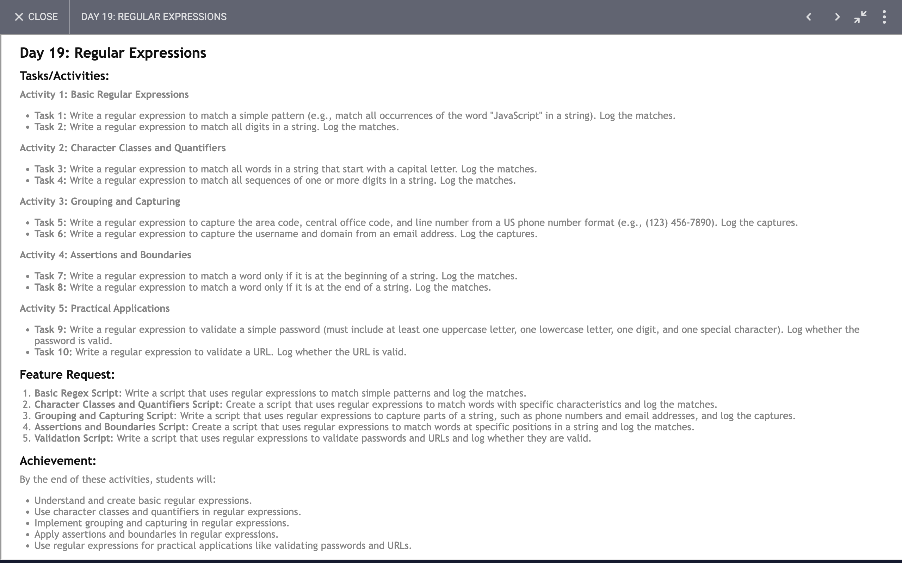

# Day 19

## Task

## Code 
[Click Here](./index.js)

### Overview of Regular Expressions and Their Functions

#### 1. **Matching Specific Words**
- **Purpose:** Find all occurrences of a specific word, regardless of case.
- **Key Feature:** Uses global and case-insensitive flags to ensure all instances are found.

#### 2. **Extracting Digits and Capitalized Words**
- **Purpose:** Identify and extract sequences of digits and words that start with a capital letter.
- **Key Feature:** Regex patterns are used to capture and list numbers and capitalized words.

#### 3. **Parsing Phone Numbers**
- **Purpose:** Extract parts of a phone number (area code, central office code, and line number) from a specific format.
- **Key Feature:** Parenthesized groups in the pattern capture distinct components of the phone number.

#### 4. **Validating Email Addresses**
- **Purpose:** Extract and validate the username and domain of an email address.
- **Key Feature:** The pattern separates and captures different parts of the email address using specific character classes.

#### 5. **Finding Words at the Beginning and End**
- **Purpose:** Identify words located at the start or end of a string.
- **Key Feature:** Anchors (start `^` and end `$`) are used to ensure the word is at the beginning or end of the string.

#### 6. **Validating Passwords**
- **Purpose:** Ensure a password meets criteria such as containing uppercase and lowercase letters, digits, and special characters.
- **Key Feature:** Lookahead assertions check for the presence of required character types and enforce minimum length.

#### 7. **Validating URLs**
- **Purpose:** Check if a URL is correctly formatted, optionally including a protocol.
- **Key Feature:** The pattern handles optional protocol and validates the structure of the URL to ensure it is well-formed.

These regex patterns and their functions demonstrate how to handle text extraction, validation, and pattern matching effectively.