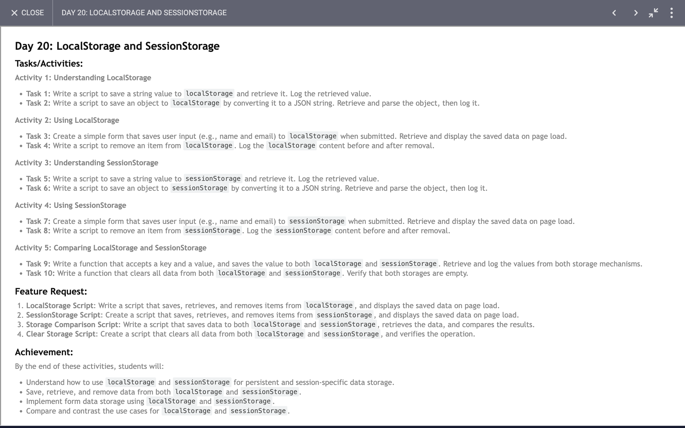

# Day 20

## Task

## Code 
[Click Here](./index.js)

### Understanding LocalStorage and SessionStorage

Here's a brief overview of how to work with `localStorage` and `sessionStorage` in JavaScript, covering key tasks and activities.

#### **LocalStorage**

**Task 1: Save and Retrieve a String Value**
- **Save a String:** Use `localStorage.setItem('key', 'value')` to store a string.
- **Retrieve a String:** Use `localStorage.getItem('key')` to retrieve the stored value.
- **Log the Retrieved Value:** Output the value to the console.

**Task 2: Save and Retrieve an Object**
- **Save an Object:** Convert the object to a JSON string using `JSON.stringify()` and store it with `localStorage.setItem()`.
- **Retrieve and Parse the Object:** Retrieve the JSON string and parse it back into an object with `JSON.parse()`.
- **Log the Object:** Output the parsed object to the console.

**Activity 2: Using LocalStorage**

**Task 3: Save Form Data**
- **Create a Form:** Include input fields for user details (e.g., name, email).
- **Save Data on Submit:** Use `localStorage.setItem()` to store form data when the form is submitted.
- **Display Data on Page Load:** Retrieve and display the stored data when the page loads.

**Task 4: Remove an Item**
- **Remove Item:** Use `localStorage.removeItem('key')` to remove a specific item.
- **Log Content:** Output the content of `localStorage` before and after removal to verify.

#### **SessionStorage**

**Task 5: Save and Retrieve a String Value**
- **Save a String:** Use `sessionStorage.setItem('key', 'value')` to store a string.
- **Retrieve a String:** Use `sessionStorage.getItem('key')` to retrieve the stored value.
- **Log the Retrieved Value:** Output the value to the console.

**Task 6: Save and Retrieve an Object**
- **Save an Object:** Convert the object to a JSON string and store it with `sessionStorage.setItem()`.
- **Retrieve and Parse the Object:** Retrieve the JSON string and parse it back into an object with `JSON.parse()`.
- **Log the Object:** Output the parsed object to the console.

**Activity 4: Using SessionStorage**

**Task 7: Save Form Data**
- **Create a Form:** Include input fields for user details.
- **Save Data on Submit:** Use `sessionStorage.setItem()` to store form data when submitted.
- **Display Data on Page Load:** Retrieve and display the stored data when the page loads.

**Task 8: Remove an Item**
- **Remove Item:** Use `sessionStorage.removeItem('key')` to remove a specific item.
- **Log Content:** Output the content of `sessionStorage` before and after removal to verify.

#### **Comparing LocalStorage and SessionStorage**

**Task 9: Save to Both Storage Types**
- **Function:** Accept a key and value, then save the value to both `localStorage` and `sessionStorage`.
- **Retrieve and Log:** Retrieve and log the values from both storages to compare.

**Task 10: Clear All Data**
- **Function:** Use `localStorage.clear()` and `sessionStorage.clear()` to clear all data from both storages.
- **Verify:** Ensure that both storages are empty by checking their content.

These tasks help understand the basic operations of `localStorage` and `sessionStorage`, including saving, retrieving, and manipulating data.