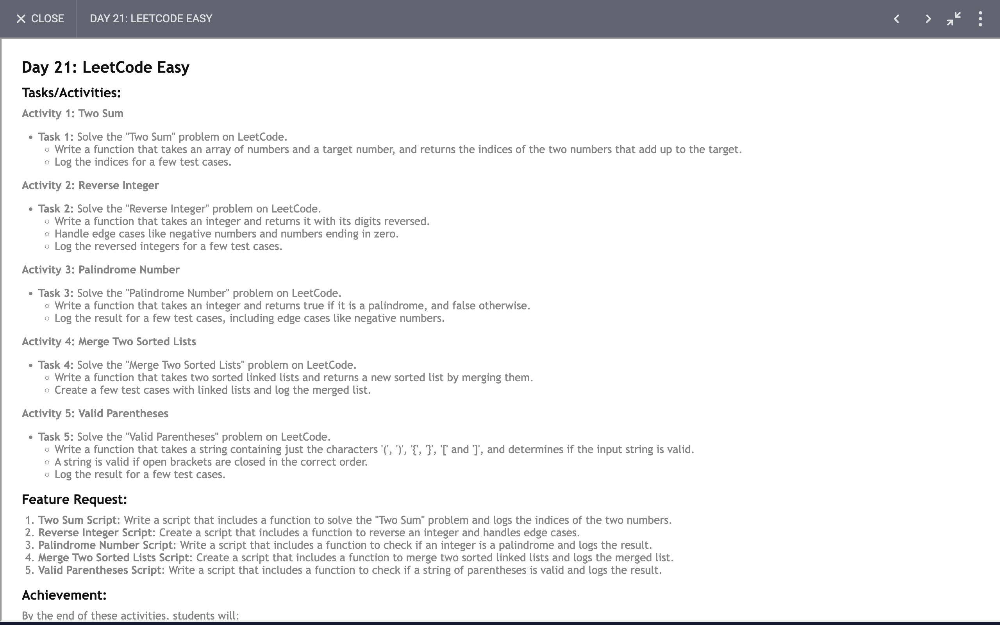

# Day 21

## Task


## Code 
[Click Here](./index.js)

## Exploring Fundamental JavaScript Functions: What We Can Learn

JavaScript is a versatile language with a rich set of functionalities. The code snippet provided demonstrates several fundamental algorithms and techniques that are valuable for both beginners and seasoned developers. Here's a brief overview of what we can learn and achieve from each function:

### 1. **Two Sum Function**

```javascript
function twoSum(arr, target){
  let map = {};
  for(let i = 0; i < arr.length; i++){
    let diff = target - arr[i];
    if(map[diff] !== undefined){
      return [map[diff], i];
    }
    map[arr[i]] = i;
  }
  return [];
}
```

**Key Concepts:**
- **Hash Maps:** Utilizes an object to store previously visited elements for quick lookup.
- **Efficient Searching:** Achieves O(n) time complexity by reducing the problem of finding two numbers that add up to a target from O(n^2) in a naive approach.
- **Algorithm Design:** Demonstrates a common problem-solving technique in computer science, useful in scenarios like finding pairs with a given sum.

### 2. **Reverse String Function**

```javascript
function reverseString(str){
  return str.split('').reverse().join('');
}
```

**Key Concepts:**
- **String Manipulation:** Shows how to manipulate strings using built-in methods.
- **Functional Chaining:** Uses method chaining to perform operations in a concise manner.
- **Practical Utility:** Useful for tasks involving formatting or transforming text data.

### 3. **Reverse Number Function**

```javascript
function reverseNumber(num){
  return parseInt(num.toString().split('').reverse().join(''));
}
```

**Key Concepts:**
- **Type Conversion:** Converts numbers to strings to utilize string manipulation methods.
- **Reverse Operations:** Demonstrates reversing numeric values, a common requirement in various computational problems.

### 4. **Palindrome Check Function**

```javascript
function isPalindrome(str){
  return str === reverseString(str);
}
```

**Key Concepts:**
- **Palindrome Detection:** Checks if a string reads the same backward as forward.
- **Integration with Other Functions:** Utilizes the `reverseString` function to solve the problem, showcasing modular code design.

### 5. **Merge Sorted Arrays Function**

```javascript
function mergeSortedArray(arr1, arr2){
  let result = [];
  let i = 0, j = 0;
  while(i < arr1.length && j < arr2.length){
    if(arr1[i] < arr2[j]){
      result.push(arr1[i]);
      i++;
    }else{
      result.push(arr2[j]);
      j++;
    }
  }
  while(i < arr1.length){
    result.push(arr1[i]);
    i++;
  }
  while(j < arr2.length){
    result.push(arr2[j]);
    j++;
  }
  return result;
}
```

**Key Concepts:**
- **Merging Algorithms:** Combines two sorted arrays into a single sorted array.
- **Two-Pointer Technique:** Demonstrates a common algorithmic approach for merging sorted lists.
- **Efficiency:** Achieves O(n + m) time complexity, where n and m are the lengths of the input arrays.

### 6. **Valid Parentheses Function**

```javascript
function validParentesis(str){
  let stack = [];
  let map = {
    '(': ')',
    '{': '}',
    '[': ']'
  };
  for(let i = 0; i < str.length; i++){
    if(map[str[i]]){
      stack.push(str[i]);
    }else{
      let last = stack.pop();
      if(str[i] !== map[last]){
        return false;
      }
    }
  }
  return stack.length === 0;
}
```

**Key Concepts:**
- **Stack Data Structure:** Uses a stack to keep track of opening parentheses and ensures they are properly closed.
- **Validation Algorithms:** Commonly used in parsing and validating expressions or code.

### Conclusion

The provided functions cover essential programming techniques and data structures in JavaScript. From hash maps and string manipulation to merging algorithms and stack-based validation, these functions illustrate foundational concepts in computer science. Mastering these techniques can significantly enhance problem-solving skills and code efficiency in real-world applications.