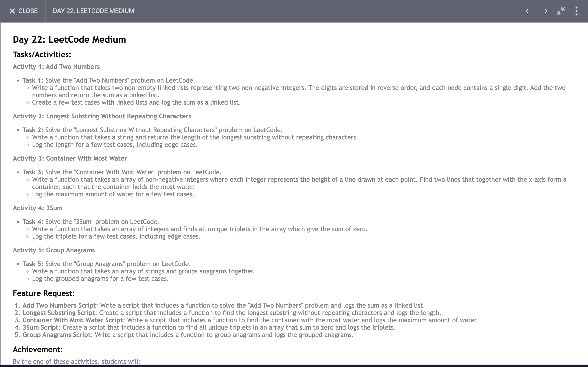

# Day 22

## Task


## Code 
[Click Here](./index.js)


## Exploring Advanced JavaScript Functions: Key Learnings and Techniques

The additional JavaScript functions provided offer a deeper dive into solving complex problems with elegant and efficient algorithms. Here’s an overview of what we can learn from each function:

### 1. **Add Two Numbers Represented by Arrays**

```javascript
function addTwoNumber(arr1, arr2){
  let result = [];
  let carry = 0;
  let i = arr1.length - 1;
  let j = arr2.length - 1;
  while(i >= 0 || j >= 0){
    let sum = carry;
    if(i >= 0){
      sum += arr1[i];
      i--;
    }
    if(j >= 0){
      sum += arr2[j];
      j--;
    }
    carry = Math.floor(sum / 10);
    result.unshift(sum % 10);
  }
  if(carry){
    result.unshift(carry);
  }
  return result;
}
```

**Key Concepts:**
- **Handling Large Numbers:** Demonstrates how to perform arithmetic operations on numbers that exceed standard data types by treating them as arrays.
- **Carry Forward Logic:** Manages the carry for each digit, a fundamental technique in numerical computations.
- **Algorithm Efficiency:** Uses array operations to achieve the addition operation with linear time complexity, considering the size of the input arrays.

### 2. **Longest Substring Without Repeating Characters**

```javascript
function longestSubstringWithoutRepeatingCharacters(str){
  let map = {};
  let left = 0;
  let max = 0;
  for(let i = 0; i < str.length; i++){
    if(map[str[i]] >= left){
      left = map[str[i]] + 1;
    }
    map[str[i]] = i;
    max = Math.max(max, i - left + 1);
  }
  return max;
}
```

**Key Concepts:**
- **Sliding Window Technique:** Utilizes a dynamic window to keep track of substrings without repeating characters.
- **Hash Map Usage:** Uses a hash map to store the last seen index of each character for efficient lookup.
- **Optimal Performance:** Achieves linear time complexity O(n), making it suitable for long strings.

### 3. **Container With Most Water**

```javascript
function containerWithMostWater(height){
  let max = 0;
  let i = 0;
  let j = height.length - 1;
  while(i < j){
    max = Math.max(max, Math.min(height[i], height[j]) * (j - i));
    if(height[i] < height[j]){
      i++;
    }else{
      j--;
    }
  }
  return max;
}
```

**Key Concepts:**
- **Two-Pointer Technique:** Efficiently computes the maximum area of water that can be trapped between two lines using two pointers.
- **Greedy Approach:** Moves pointers inward based on height comparison to maximize the area.
- **Optimal Complexity:** Operates in linear time O(n), making it scalable for large inputs.

### 4. **Three Sum Problem**

```javascript
function threeSum(arr){
  let result = [];
  arr.sort((a, b) => a - b);
  for(let i = 0; i < arr.length - 2; i++){
    if(i === 0 || (i > 0 && arr[i] !== arr[i - 1])){
      let low = i + 1;
      let high = arr.length - 1;
      let sum = 0 - arr[i];
      while(low < high){
        if(arr[low] + arr[high] === sum){
          result.push([arr[i], arr[low], arr[high]]);
          while(low < high && arr[low] === arr[low + 1]){
            low++;
          }
          while(low < high && arr[high] === arr[high - 1]){
            high--;
          }
          low++;
          high--;
        }else if(arr[low] + arr[high] < sum){
          low++;
        }else{
          high--;
        }
      }
    }
  }
  return result;
}
```

**Key Concepts:**
- **Sorting and Two-Pointer Technique:** Combines sorting with two-pointer technique to find all unique triplets that sum to zero.
- **Handling Duplicates:** Skips over duplicate values to ensure unique triplets.
- **Algorithmic Complexity:** Provides a time complexity of O(n^2) by leveraging sorting and two-pointer techniques, making it efficient for large arrays.

### 5. **Group Anagrams**

```javascript
function groupAnagrams(strs){
  let map = {};
  for(let str of strs){
    let key = str.split('').sort().join('');
    if(!map[key]){
      map[key] = [];
    }
    map[key].push(str);
  }
  return Object.values(map);
}
```

**Key Concepts:**
- **Anagram Grouping:** Groups strings that are anagrams by sorting each string to use as a key in a hash map.
- **Hash Map Efficiency:** Utilizes a hash map to efficiently group and retrieve anagrams.
- **Simplifying Grouping:** Provides a clear and efficient solution for problems involving grouping of similar items.

### Conclusion

The provided functions cover a range of advanced algorithms and problem-solving techniques. From handling large numbers and finding unique substrings to optimizing area calculations and grouping anagrams, these examples illustrate key concepts in algorithm design and data structures. Mastery of these techniques can greatly enhance your problem-solving skills and efficiency in coding challenges.